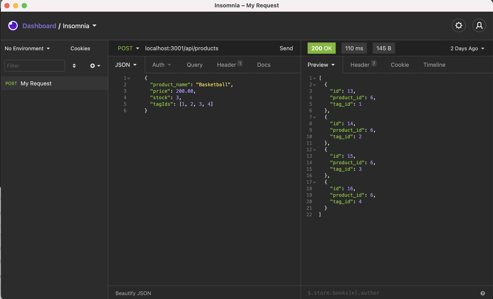

# E-Commerce Back End

## Description

E-Commerce Back End demonstrates the functionality of using MySql db, Node sequalize, and Express server to initiate CRUD operations on a database, and return asscoiated json in response.

## Uses

JS/Node/Express/MySQL

## Back-end Librarys

sequelize

## Installation Instructions

```
npm install
```

## Usagage Information

```
node server.js
```

## Video Walkthrough

https://erickmeline.github.io/Employee-Tracker/

## Screenshot


